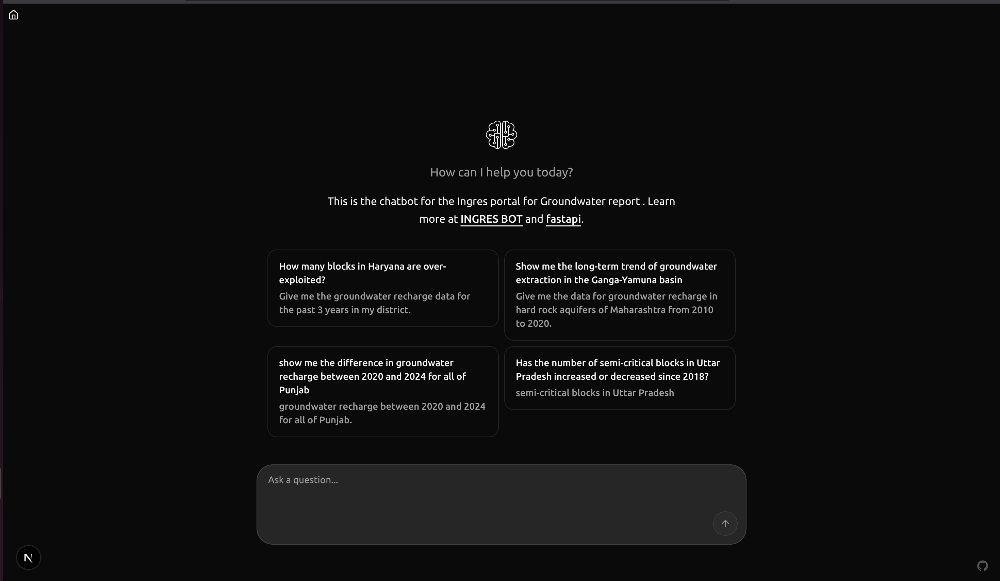

# INGRES AI Chatbot

## Project Overview

The **INGRES AI Chatbot** is an intelligent conversational AI system designed to revolutionize access to India's groundwater resource data from the Central Ground Water Board (CGWB). This project transforms the traditional INGRES portal into a dynamic, AI-powered knowledge hub that makes critical groundwater information easily accessible through natural language interactions.

## 🚀 Technology Stack

### Frontend Technologies
- **Next.js 15.5.3** - React framework with server-side rendering and API routes
- **React 19.1.0** - Modern UI library with latest features
- **TypeScript 5.9.2** - Type-safe JavaScript for better development experience
- **Tailwind CSS 4** - Utility-first CSS framework for responsive design
- **Framer Motion 12.23.13** - Advanced animations and transitions
- **Radix UI** - Accessible, unstyled UI components
- **React Code Blocks** - Syntax highlighting for code display
- **Sonner** - Toast notifications system
- **SWR** - Data fetching and caching library
- **Marked** - Markdown parser for rich text rendering

### Backend & API Integration
- **FastAPI** (Python) - High-performance API framework
- **Server-Sent Events (SSE)** - Real-time streaming responses
- **Microsoft Fetch Event Source** - Client-side event stream handling

### AI & Machine Learning
- **Retrieval-Augmented Generation (RAG)** - Ensures accurate, context-aware responses
- **Vector Database** - Semantic search capabilities
- **Large Language Models (LLM)** - Natural language understanding and generation
- **Machine Learning Models** - Advanced data analysis and forecasting

### Development Tools
- **Turbopack** - Fast build system for Next.js
- **ESLint** - Code quality and consistency
- **PostCSS** - CSS processing and optimization

## 🤖 What is INGRES Chatbot?

The INGRES AI Chatbot is a sophisticated conversational interface that serves as your intelligent assistant for groundwater data queries. It combines the power of artificial intelligence with comprehensive groundwater datasets to provide:

### Core Capabilities
- **Natural Language Queries**: Ask questions in plain English about groundwater data
- **Real-time Streaming Responses**: Get immediate, contextual answers with smooth streaming
- **Interactive Code Examples**: View and copy code snippets for data analysis
- **Markdown Support**: Rich text formatting for comprehensive responses
- **Responsive Design**: Works seamlessly across desktop and mobile devices

### Use Cases
- **Government Officials**: Quick access to policy-relevant groundwater statistics
- **Researchers**: Advanced data analysis and trend identification
- **General Public**: Simple queries about local groundwater conditions
- **Developers**: API integration examples and data access methods

## The Problem

The existing INGRES portal, while a valuable data repository, presents several challenges:
- **Poor User Experience:** Navigating vast datasets is complex and time-consuming.
- **Limited Accessibility:** The portal is not easily usable by non-experts or those who are not proficient in English.
- **Lack of Actionable Insights:** The data is presented in a raw format, without context or dynamic analysis.

## The Solution

Our solution is a multi-interface system centered around a conversational AI chatbot. It's built on a **Retrieval-Augmented Generation (RAG)** architecture to ensure accuracy and is tailored to meet the specific needs of different user groups.


### Key Features
- **Intelligent Chatbot:** A natural language interface for querying groundwater data via text and voice.
- **Dynamic Visualizations:** On-demand generation of interactive maps, charts, and graphs.
- **Multilingual Support:** Support for key Indian regional languages to broaden accessibility.
- **User-Specific Dashboards:**
  - **Public Interface:** A simple, intuitive chatbot for quick queries.
  - **Policymakers' Dashboard:** A secure, high-level view of key metrics for informed decision-making.
  - **Researchers' Workbench:** An interface with pre-trained ML models for advanced data analysis and forecasting.
- **Real-time Data Integration:** Direct connection to the INGRES database to provide the latest assessment data.

## 🏗️ Project Architecture

The system follows a modern, microservices-oriented architecture designed for scalability and maintainability:

### Frontend Layer (Next.js)
- **Framework**: Next.js 15.5.3 with Turbopack for ultra-fast development
- **Rendering**: Server-Side Rendering (SSR) for optimal performance
- **State Management**: SWR for efficient data fetching and caching
- **UI Components**: Radix UI primitives with custom styling
- **Animations**: Framer Motion for smooth user interactions
- **Styling**: Tailwind CSS 4 with utility-first approach

### Backend API Layer (FastAPI)
- **Framework**: Python FastAPI for high-performance API endpoints
- **Communication**: Server-Sent Events (SSE) for real-time streaming
- **Authentication**: Secure dashboard access for authorized users
- **Request Orchestration**: Coordinates between AI services and data layers

### Data & AI Layer
- **Database**: PostgreSQL with PostGIS for geospatial data
- **Vector Store**: Semantic search and similarity matching
- **RAG Pipeline**: Retrieval-Augmented Generation for accurate responses
- **ML Models**: Predictive analytics and trend analysis
- **LLM Integration**: Large language models for natural language processing

### Key Architectural Features
- **Microservices Design**: Independent, scalable components
- **Real-time Streaming**: Immediate response delivery
- **Type Safety**: Full TypeScript implementation
- **Responsive UI**: Mobile-first design approach
- **Error Handling**: Comprehensive error boundaries and fallbacks

## 🛠️ Installation & Setup

### Prerequisites
- **Node.js** (v18 or higher)
- **npm** or **yarn** package manager
- **Git** for version control
- **Python** (v3.9 or higher) for backend services

### Frontend Setup

1. **Clone the Repository**
```bash
git clone https://github.com/vermaapurva33/INGRES_CHATBOT.git
cd INGRES_CHATBOT/chatbot-client
```

2. **Install Dependencies**
```bash
npm install
# or
yarn install
```

3. **Environment Configuration**
```bash
# Create environment file
cp .env.example .env.local

# Configure API endpoint
NEXT_PUBLIC_API_URL=http://localhost:8000/chat/stream
```

4. **Start Development Server**
```bash
npm run dev
# or
yarn dev
```

5. **Access the Application**
   - Frontend: `http://localhost:3000`
   - Development server runs with hot reload
   - Turbopack enabled for faster builds

### Available Scripts
- `npm run dev` - Start development server with Turbopack
- `npm run build` - Build production application
- `npm run start` - Start production server
- `npm run lint` - Run ESLint for code quality

### Backend Setup (Future Implementation)
```bash
# Navigate to backend directory
cd ../backend

# Install Python dependencies
pip install -r requirements.txt

# Start FastAPI server
uvicorn main:app --reload --port 8000
```

## 🌟 Features in Detail

### Real-time Chat Interface
- Streaming responses with typing indicators
- Message history with persistent storage
- Copy-to-clipboard functionality for responses
- Markdown rendering for rich text content
- Code syntax highlighting

### Advanced UI Components
- Custom avatar system for user and AI
- Smooth animations and transitions
- Responsive design for all screen sizes
- Dark/light theme support
- Toast notifications for user feedback

### Data Visualization Capabilities
- Interactive charts and graphs
- Geospatial mapping integration
- Export functionality for data analysis
- Real-time data updates

## 📱 User Experience

### For General Users
- Simple, conversational interface
- No technical knowledge required
- Instant answers to groundwater queries
- Mobile-friendly design

### For Researchers & Analysts
- Advanced query capabilities
- Data export options
- Integration with analysis tools
- Historical trend analysis

### For Policymakers
- Executive dashboard views
- Key performance indicators
- Secure access controls
- Customizable reporting

## 🔧 Technical Highlights

- **Performance**: Turbopack build system for 10x faster development
- **Type Safety**: Full TypeScript implementation with strict typing
- **Accessibility**: WCAG compliant UI components
- **SEO Optimized**: Server-side rendering for better search visibility
- **Scalability**: Microservices architecture for horizontal scaling
- **Security**: Input validation and secure API endpoints

## 📈 Future Enhancements

- Multilingual support for Indian regional languages
- Voice input and output capabilities
- Advanced ML model integration
- Real-time collaboration features
- Mobile application development

## 🤝 Contributing

We welcome contributions to improve the INGRES AI Chatbot! Please see our [Contributing Guidelines](CONTRIBUTING.md) for details on how to get started.

## 📄 License

This project is licensed under the MIT License - see the [LICENSE](LICENSE) file for details.

## 📞 Support

For questions, issues, or contributions, please:
- Open an issue on GitHub
- Contact the development team
- Check our documentation in the `docs/` directory