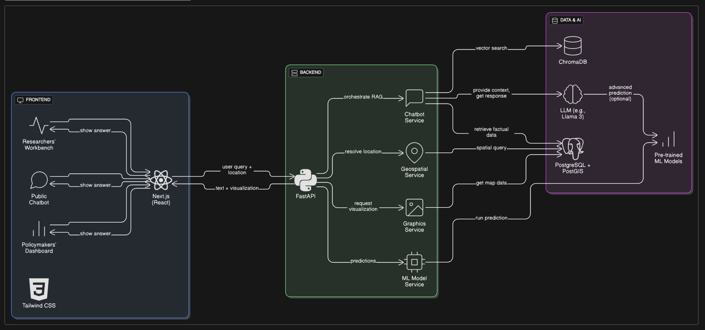

# System Architecture

The **INGRES AI Chatbot** is designed as a scalable, modular, and secure system. The architecture is built on a microservices-oriented approach, ensuring that each component can be developed, deployed, and scaled independently.

---

## 1. High-Level Architecture Diagram

This diagram illustrates the flow of data and requests through the system, from the user's browser to the core intelligence layer and back.

---

## 2. Architectural Layers Explained in Detail

### 2.1. Frontend Layer
This layer is responsible for the user interface and experience. It is a client-side application that communicates with our backend API.
- **Technology:** **Next.js** (React) with **Tailwind CSS**.
- **Role:** It renders all three user-facing interfaces: the **Public Chatbot**, the **Policymaker's Dashboard**, and the **Researcher's Workbench**. Next.js's Server-Side Rendering (SSR) ensures a fast initial load, while its API Routes serve as a secure **Backend for Frontend (BFF)**, preventing direct client-side access to our core data and AI services.

### 2.2. Backend API Layer
This layer serves as the central API gateway. It receives requests from the frontend and orchestrates the complex logic by communicating with the underlying AI and data services.
- **Technology:** **Python** with **FastAPI**.
- **Role:** It acts as the "traffic cop" of the application. It validates incoming requests, handles authentication for secure dashboards, routes queries to the correct service (e.g., the RAG engine for the chatbot or the ML service for a researcher), and formats the final response before sending it back to the frontend.

---

## 3. The Core Intelligence: Data & AI Layer

This is the most critical and complex layer, housing the entire knowledge base and analytical models. It is fully decoupled from the Backend API for a robust, scalable design.

### 3.1. Retrieval-Augmented Generation (RAG) Architecture

The RAG process is the foundation of our intelligent chatbot, ensuring every answer is accurate and grounded in facts.

#### **Detailed Diagram of the RAG Process**

#### **Step-by-Step Data Flow:**
1.  **User Query:** A user submits a question like "What is the groundwater status in my village?"
2.  **Vectorization:** The Backend API uses a pre-trained **Embedding Model** (e.g., Google's `text-embedding-gecko`) to convert the user's query into a high-dimensional vector. This vector captures the semantic meaning of the question.
3.  **Retrieval:** This query vector is sent to the **Vector Database (ChromaDB)**, which performs an incredibly fast similarity search. It finds and retrieves the most relevant data chunks (as vectors) from the database. For example, it might find chunks with information about "groundwater," "status," and "village," linking them to specific database records for that location.
4.  **Context Augmentation:** The retrieved raw data (e.g., a row from a PostgreSQL table) is formatted into a clear, concise paragraph and then attached to the original user query as "context." This creates an **augmented prompt**.
5.  **Generation:** The augmented prompt is sent to the **Large Language Model (LLM)**. This is a powerful model (e.g., Llama 3) that has been specifically instructed to "answer the user's question *based only on the provided context*."
6.  **Response:** The LLM generates a human-readable, factually accurate response, which the Backend API sends back to the frontend for display.

### 3.2. ML Models for Research

This part of the architecture provides powerful, on-demand analytical capabilities for researchers without the need for manual data science.

- **Pre-trained Models:** A suite of specialized ML models (e.g., **LSTMs** for time-series forecasting, **Random Forests** for classification) is pre-trained on historical INGRES data.
- **Dedicated Service:** These models are hosted on a dedicated service, such as **Google Cloud AI Platform**. This allows them to be accessed via a simple API call, abstracting away the computational complexity.
- **Data Flow for a Research Query:**
    1.  A researcher selects a task (e.g., "Predict groundwater level for the next 5 years") on their dashboard.
    2.  The Frontend makes an API call to a specific endpoint on the Backend (e.g., `/api/research/predict`).
    3.  The Backend forwards the request to the hosted ML model service with the necessary parameters (e.g., `location=Indore`, `time_horizon=5 years`).
    4.  The ML model runs its prediction and returns the result (e.g., a time-series data array).
    5.  The Backend receives the data and sends it back to the Frontend.
    6.  The Frontend renders the final result in a clear, interactive visualization like a line graph.

---

